# StarForge Testing Guide

## Overview

StarForge uses a two-tier testing strategy:
1. **Fast Infrastructure Validation** - Runs on every PR (~2 minutes)
2. **Nightly Integration Tests** - Full end-to-end workflow testing (~45 minutes)

---

## Infrastructure Validation (CI)

**Runs:** On every push and pull request
**Duration:** < 2 minutes
**Cost:** Free (no API calls)

### What It Tests
- ✅ File structure completeness
- ✅ Agent definition presence
- ✅ Daemon script executability
- ✅ Library file availability
- ✅ Bash syntax correctness
- ✅ Configuration parsing
- ✅ Agent slot management logic

### Workflow File
`.github/workflows/infrastructure-test.yml`

### Running Locally
```bash
# Validate file structure
bash tests/validate-infrastructure.sh

# Test daemon configuration parsing
cd /tmp && mkdir -p test-project
cd test-project
bash /path/to/starforge/bin/install.sh
export PARALLEL_DAEMON=true
export MAX_CONCURRENT_AGENTS=4
timeout 5 .claude/bin/daemon-runner.sh 2>&1 | grep "Parallel execution enabled"
```

### Success Criteria
All validation checks must pass for PR to be mergeable.

---

## Nightly Integration Test

**Runs:** Every night at 2 AM UTC (manual trigger available)
**Duration:** Up to 45 minutes
**Cost:** Claude API usage (~$2-5 per run)
**Repository:** `JediMasterKT/starforge-master-test`

### What It Tests
- ✅ Full agent workflow execution
- ✅ 4 concurrent junior-engineers
- ✅ GitHub issue → PR creation
- ✅ Agent slot coordination
- ✅ Discord notifications
- ✅ Daemon autonomous operation
- ✅ Worktree isolation
- ✅ Error handling and recovery

### Workflow File
`.github/workflows/nightly-integration.yml`

### Test Flow

```mermaid
graph TD
    A[Reset Test Env] --> B[Create 4 Fresh Issues]
    B --> C[Configure Parallel Daemon]
    C --> D[Create Trigger Files]
    D --> E[Start Daemon]
    E --> F{Monitor Execution}
    F -->|Every 5 min| G[Check Progress]
    G --> F
    F -->|45 min max| H[Stop Daemon]
    F -->|4 PRs Created| H
    H --> I[Collect Results]
    I --> J[Validate Success]
    J -->|>= 3 PRs| K[✅ SUCCESS]
    J -->|< 3 PRs| L[❌ FAILURE]
    K --> M[Notify Discord]
    L --> M
```



### Setup Requirements

#### 1. GitHub Secrets
Add these to your repository settings:

```bash
# Required
ANTHROPIC_API_KEY      # Your Claude API key
DISCORD_WEBHOOK_URL    # Discord webhook for notifications

# Pre-configured
GITHUB_TOKEN          # Automatically provided by GitHub Actions
```

#### 2. Test Repository Access
The workflow uses `JediMasterKT/starforge-master-test` by default. To use your own:

1. Fork or create a test repository
2. Update `TEST_REPO` in `.github/workflows/nightly-integration.yml`
3. Ensure GitHub Actions has write access

#### 3. Discord Webhook Setup
1. Go to Discord Server Settings → Integrations → Webhooks
2. Create webhook for #starforge-nightly-tests channel
3. Copy webhook URL
4. Add as `DISCORD_WEBHOOK_URL` secret in GitHub

### Manual Trigger

Run on-demand via GitHub Actions UI:

1. Go to Actions → Nightly Integration Test
2. Click "Run workflow"
3. Optional parameters:
   - **Max Agents:** Number of concurrent agents (default: 4)
   - **Test Duration:** Max runtime in minutes (default: 45)

### Success Criteria

**Pass:** ≥ 3 out of 4 PRs created (75% success rate)
**Fail:** < 3 PRs created

### Monitoring

**During Execution:**
- Watch GitHub Actions logs in real-time
- Discord notifications for key events
- Agent slot status logged every 5 minutes

**After Completion:**
- Full test results in Discord
- Artifacts uploaded to GitHub Actions:
  - `test-results.md` - Summary report
  - `daemon-output.log` - Complete daemon logs
- Failed issues commented with error details

### Cost Management

**Estimated Costs per Run:**
- 4 concurrent agents × ~10 minutes each = 40 agent-minutes
- Average: $2-5 per test run
- Monthly (30 runs): ~$60-150

**To Reduce Costs:**
1. Run fewer agents: Set `max_agents: 2`
2. Shorter duration: Set `test_duration: 30`
3. Less frequent: Change cron to `0 2 * * 1` (Mondays only)

### Troubleshooting

**Test Times Out:**
- Check daemon logs in artifacts
- Verify ANTHROPIC_API_KEY is valid
- Ensure test repository has no merge conflicts

**PRs Not Created:**
- Check trigger files were created correctly
- Verify agent definitions are up to date
- Review daemon logs for errors

**Discord Notifications Fail:**
- Verify webhook URL is correct
- Check webhook hasn't been deleted
- Ensure Discord server is accessible

---

## Test Repository Structure

`JediMasterKT/starforge-master-test` contains:

```
starforge-master-test/
├── src/                     # Mock Express.js app
│   ├── server.js
│   ├── models/
│   └── routes/
├── .claude/                 # StarForge infrastructure
│   ├── agents/             # 5 agent definitions
│   ├── bin/                # daemon-runner.sh
│   ├── lib/                # Libraries
│   ├── triggers/           # Trigger files (created by CI)
│   └── coordination/       # Pre-written code snippets
├── package.json
└── README.md
```

### Maintenance

**Weekly:**
- Review test results for patterns
- Close old test PRs/issues

**Monthly:**
- Update code snippets if APIs change
- Review cost trends

**As Needed:**
- Reset test data if accumulates
- Update test scenarios

---

## Adding New Tests

### Infrastructure Test
Add checks to `.github/workflows/infrastructure-test.yml`:

```yaml
- name: Validate New Feature
  run: |
    echo "🧪 Testing new feature..."
    # Add validation logic
    test -f templates/new-file.sh || exit 1
    echo "✅ New feature valid"
```

### Integration Test
Modify test scenarios in `.github/workflows/nightly-integration.yml`:

```yaml
- name: Create Custom Test Issues
  run: |
    # Create issues that test your new feature
    gh issue create --title "Test New Feature" ...
```

---

## CI Badge

Add to your README.md:

```markdown
[](https://github.com/YOUR_ORG/starforge-master-discord/actions?query=workflow%3A"Infrastructure+Validation")
[](https://github.com/YOUR_ORG/starforge-master-discord/actions?query=workflow%3A"Nightly+Integration+Test")
```

---

## Metrics to Track

- **Infrastructure Test Success Rate:** Should be ~100%
- **Nightly Test Success Rate:** Target ≥ 75% (3/4 PRs)
- **Average Test Duration:** Track over time
- **Cost per Test Run:** Monitor API usage
- **Time to Fix Failures:** Track MTTR

---

## Questions?

- **Slack:** #starforge-testing
- **Issues:** File bugs with `test-infrastructure` label
- **Docs:** See full documentation in `/docs`
