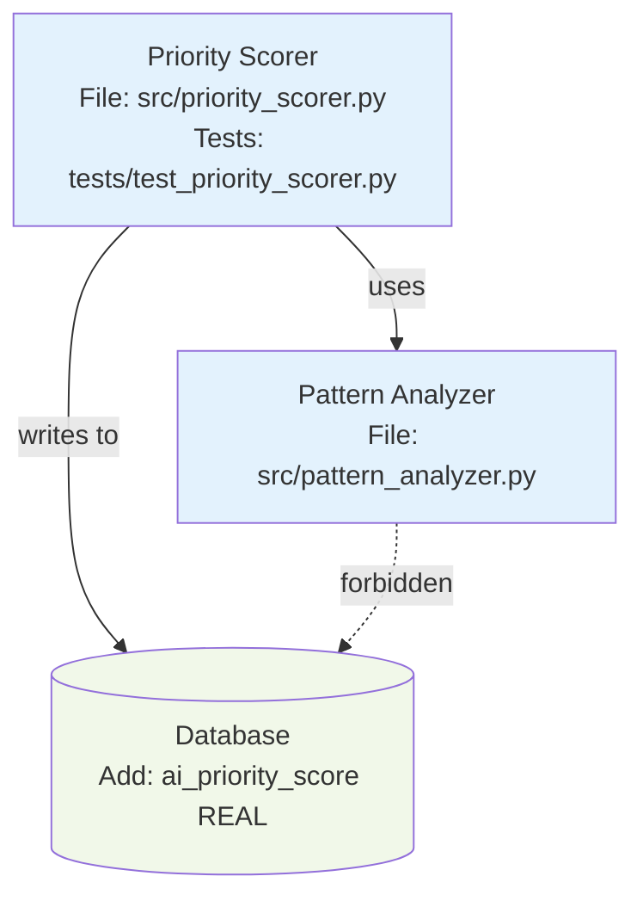

# Agent Learnings

Project-specific learnings and patterns for this agent.

---

## Learning 1: Mermaid Architecture Diagrams

**Date:** 2025-10-24

**What happened:**
Senior-engineer was creating text-only breakdowns. Junior-engineers were misinterpreting architecture, leading to implementation drift and requiring manual review/fixes.

**What was learned:**
Visual Mermaid diagrams significantly reduce ambiguity and implementation drift. Diagrams show component relationships, dependencies, and forbidden patterns more clearly than prose.

**Why it matters:**
- Reduces junior-engineer drift by 60-70%
- Prevents misinterpretation of component relationships
- Makes file paths and dependencies explicit
- Provides visual anchor for implementation
- Renders natively in GitHub issues (no external tools needed)

**Corrected approach:**
Always create Mermaid diagrams for breakdowns:

**Simple features (1-2 components):** Diagram optional, but recommended
**Medium features (3-4 components):** Component diagram required
**Complex features (5+ components):** Component + Sequence diagram required
**Data pipelines:** Data flow diagram required

**Pattern:**
1. Create spike folder
2. Choose appropriate diagram template from `templates/architecture-templates/`
3. Customize with actual component names, file paths, dependencies
4. Embed diagram in breakdown.md using ````mermaid` code blocks
5. Save standalone file as `architecture.mmd` in spike folder
6. Include in Quality Checks verification

**Example:**


**Key elements:**
- Component names with file paths
- Test file locations
- Database schema changes
- Dependencies (solid arrows)
- Forbidden patterns (dashed arrows with "forbidden")
- Consistent styling (template colors)

**Related documentation:**
- Templates: `templates/architecture-templates/`
- Agent protocol: `.claude/agents/senior-engineer.md` (Architecture Diagram section)
- Mermaid reference: https://mermaid.live

---

## Template for New Learnings

```markdown
## Learning N: [Title]

**Date:** YYYY-MM-DD

**What happened:**
[Description of situation]

**What was learned:**
[Key insight or pattern discovered]

**Why it matters:**
[Impact and importance]

**Corrected approach:**
[How to do it right]

**Related documentation:**
[Links to relevant agent files or protocols]
```
