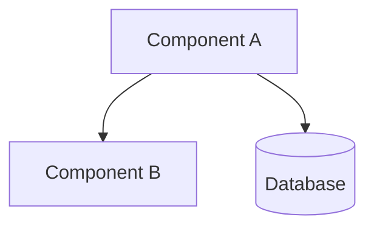
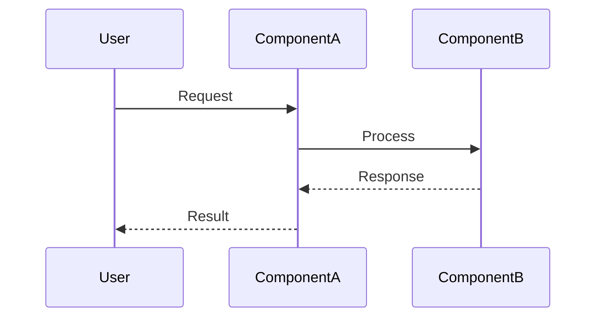
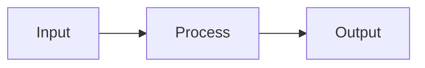
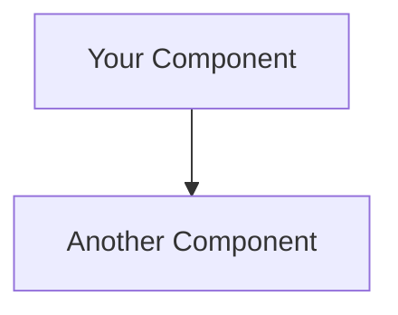
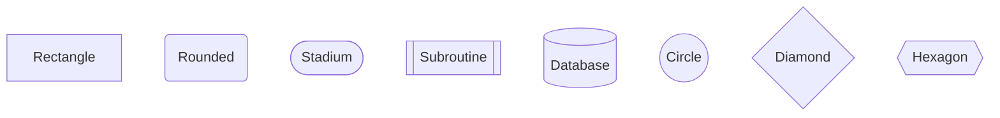
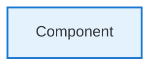

# Mermaid Architecture Diagram Templates

This directory contains reusable Mermaid diagram templates for documenting StarForge architectures.

## Available Templates

### 1. Component Diagram (`component-diagram.mmd`)
**Use for:** Multi-component features, service dependencies, database interactions

**Example:**


**Best for:**
- Features with 2+ components
- Showing dependencies between modules
- Database schema changes
- External API integrations

---

### 2. Sequence Diagram (`sequence-diagram.mmd`)
**Use for:** Request/response flows, multi-step processes, agent handoffs

**Example:**


**Best for:**
- API call sequences
- Agent coordination workflows
- Time-ordered interactions
- Request/response patterns

---

### 3. Data Flow Diagram (`data-flow.mmd`)
**Use for:** Data transformations, ETL processes, input/output flows

**Example:**


**Best for:**
- Data pipelines
- Transformation workflows
- Validation flows
- State transitions

---

## When to Use Which Diagram

| Feature Complexity | Recommended Diagram(s) |
|-------------------|------------------------|
| Simple (1 component) | Optional - text may suffice |
| Medium (2-4 components) | Component diagram |
| Complex (5+ components) | Component + Sequence diagram |
| Data pipelines | Data flow diagram |
| Multi-agent workflows | Sequence diagram |

---

## Quick Start

### 1. Choose the Right Template
Based on your feature, select the appropriate diagram type from above.

### 2. Copy Template
```bash
cp templates/architecture-templates/component-diagram.mmd \
   .claude/spikes/spike-{date}/architecture.mmd
```

### 3. Customize
Edit the `.mmd` file:
- Replace component names
- Update file paths
- Adjust relationships
- Add project-specific details

### 4. Include in Breakdown
In your `breakdown.md`:
````markdown
## Architecture



**Components:**
- Component A: Description (file path)
- Component B: Description (file path)
````

---

## Mermaid Syntax Reference

### Basic Shapes


### Arrows
```mermaid
graph LR
    A --> B       %% Solid arrow
    C -.-> D      %% Dotted arrow
    E ==> F       %% Thick arrow
    G -->|label| H  %% Labeled arrow
```

### Styling


---

## Examples from StarForge

### Example 1: Daemon Architecture (Complex)
Used all 3 diagram types:
- Component diagram for overall system structure
- Sequence diagram for trigger processing flow
- Data flow diagram for error handling paths

**Location:** `.claude/spikes/spike-20251024-1555-daemon-architecture/`

### Example 2: Discord Integration (Medium)
Used component diagram only:
- Showed webhook handler, Discord API, database
- File paths for each component
- Dependencies clearly marked

---

## GitHub Integration

Mermaid diagrams render automatically in:
- GitHub README files
- GitHub Issues (tickets)
- GitHub Pull Requests
- GitHub Discussions

**No special setup needed** - GitHub natively supports Mermaid!

---

## Tips for Effective Diagrams

### DO:
✅ Show file paths in component labels
✅ Include test file locations
✅ Label all relationships clearly
✅ Use consistent styling (colors)
✅ Keep diagrams focused (one concern per diagram)
✅ Show forbidden patterns with dashed lines

### DON'T:
❌ Overcrowd diagrams (max 8-10 nodes)
❌ Mix concerns (component structure + data flow)
❌ Skip labels on arrows
❌ Forget to update diagrams when architecture changes
❌ Use generic names ("Service A", "Component B")

---

## Learning Resources

### Official Mermaid Documentation
- Live Editor: https://mermaid.live
- Syntax Guide: https://mermaid.js.org/intro/
- Examples: https://mermaid.js.org/ecosystem/integrations.html

### StarForge-Specific
- Agent learnings: `.claude/agents/agent-learnings/senior-engineer/learnings.md`
- Example breakdowns: `.claude/spikes/`

---

## Questions?

If diagram requirements are unclear:
1. Check existing spikes for examples
2. Review agent learnings
3. Ask in the breakdown clarification phase
4. When in doubt, start with a component diagram

---

**Last Updated:** 2025-10-24
**Maintainer:** StarForge Senior-Engineer Agent
